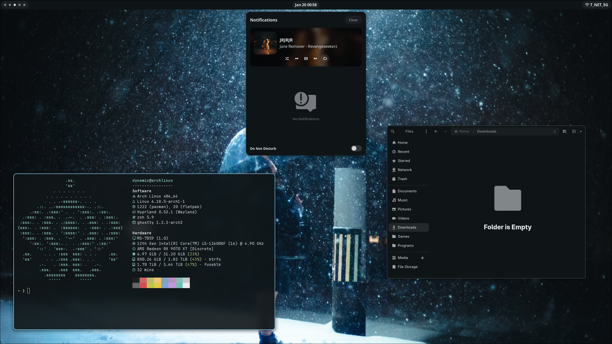

# Dotfiles



**Personal desktop configuration for Arch Linux**

## Components

| Type          | Name                                                        |
| ------------- | ----------------------------------------------------------- |
| Compositor    | [Hyprland](https://hypr.land/)                              |
| Desktop Shell | [Quickshell](https://github.com/Dyyynamic/shell)            |
| Launcher      | [Walker](https://github.com/abenz1267/walker)               |
| Wallpaper     | [Awww](https://codeberg.org/LGFae/awww)                     |
| Theme         | [Matugen](https://github.com/InioX/matugen)                 |
| Terminal      | [Ghostty](https://ghostty.org/)                             |
| Shell         | Zsh + [Starship](https://starship.rs/)                      |

## Installation

> [!IMPORTANT]
> This script assumes a fresh Arch Linux installation with a running Hyprland session.

Run the setup script:

```bash
curl -fsSL https://raw.githubusercontent.com/Dyyynamic/dotfiles/hypr/setup.sh | bash
```

Host-specific configs (monitors, default apps, etc.) can be modified under `~/.dotfiles/hosts/<hostname>`.

## Usage

Change wallpaper using matugen:

```bash
matugen image /path/to/wallpaper.jpg
```
